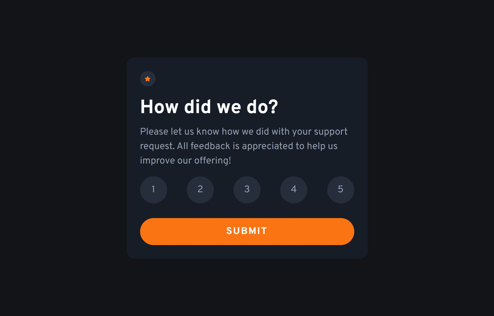

# Frontend Mentor - Interactive rating component solution

This is a solution to the [Interactive rating component challenge on Frontend Mentor](https://www.frontendmentor.io/challenges/interactive-rating-component-koxpeBUmI). Frontend Mentor challenges help you improve your coding skills by building realistic projects.

## Table of contents

- [Frontend Mentor - Interactive rating component solution](#frontend-mentor---interactive-rating-component-solution)
  - [Table of contents](#table-of-contents)
  - [Overview](#overview)
    - [The challenge](#the-challenge)
    - [Screenshot](#screenshot)
    - [Links](#links)
  - [My process](#my-process)
    - [Built with](#built-with)
    - [What I learned](#what-i-learned)
    - [Continued development](#continued-development)
  - [Author](#author)

**Note: Delete this note and update the table of contents based on what sections you keep.**

## Overview

### The challenge

Users should be able to:

- View the optimal layout for the app depending on their device's screen size
- See hover states for all interactive elements on the page
- Select and submit a number rating
- See the "Thank you" card state after submitting a rating

### Screenshot



### Links

- Solution URL: [GitHub](https://github.com/baenningerlevin/rating-component)
- Live Site URL: [Netlify](https://levin-baenninger-rating-component.netlify.app/)

## My process

### Built with

- Semantic HTML5 markup
- CSS custom properties
- Flexbox
- Mobile-first workflow

### What I learned

In this section I learned how to use the `.foreach`-Method:

```JavaScript
rates.forEach((rate) => {
  rate.addEventListener('click', () => {
    rates.forEach((btn) => {
      btn.classList.remove('active');
    });

    rate.classList.add('active');

    ratingEl.textContent = rate.textContent;
  });
});
```

### Continued development

I still have to learn a lot about JavaScript, especially about methods and how to write clean code.

Meanwhile I have got pretty good with writing HTML and CSS. I can see patterns way quicker than before.

## Author

- Website - [Levin Bänninger](https://levinbaenninger.dev)
- Frontend Mentor - [@levinbaenninger](https://www.frontendmentor.io/profile/levinbaenninger)
